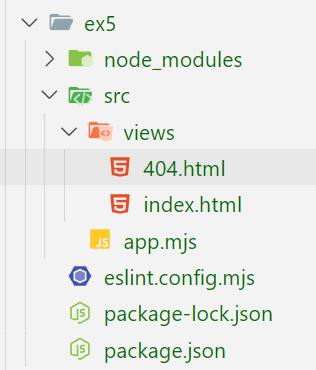
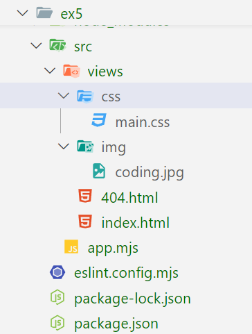

# Exercice 5 : serveur Web avec les pages HTML

1. Créez un serveur Web qui permet de rendre le contenu d'une page HTML à partir de la route /

## Spécifications techniques

- Le serveur écoute sur le ***PORT 5000***
- Créez un dossier src contenant le views
- Le dossier views contient 2 pages HTML, index.html et 404.html cf. arborescence ci-dessous
- Renvoyez la page index.html lorsqu'une requête est envoyée sur la route /
- Renvoyez la page 404.html lorsqu'une requête est envoyée sur une autre route que /
- Utilisez les modules `node:fs`, `node:http` et `node:path`

## Arborescence dossiers

---

## BONUS

1. Ajoutez un dossier `css` dans `src` et ajoutez un fichier de style dans le dossier `src/css`
2. Chargez le fichier CSS dans la page HTML
3. Essayez côté serveur de charger les fichiers CSS
4. Ajoutez le lien de votre fichier CSS dans le HTML
4. Faites la même en chose en ajoutant dossier `img` dans `src`
5. De même côté serveur charger les fichiers d'image

## Arborescence dossiers avec le bonus

